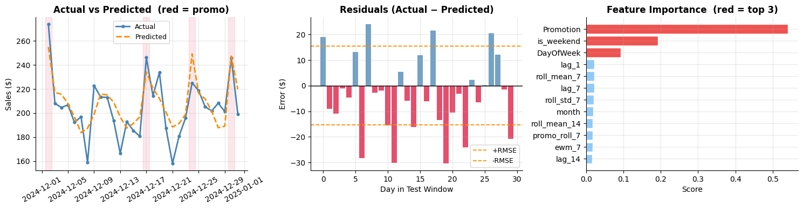

# Store Sales Forecasting & Business Intelligence

## 📌 Objective
This project analyses daily retail store sales and builds a time-series forecasting model to predict short-term demand.

## 📊 Key Tasks
- Exploratory Data Analysis (trend, promotion impact, weekly pattern)
- Time-series feature engineering (lag & rolling features)
- XGBoost regression model training
- Temporal validation using last 30 days test set
- 7-day recursive sales forecasting
- Business insights for promotion strategy and inventory planning

## ⚙️ Model Performance
- RMSE: 16.14
- MAPE: 6.59%
- Improvement over naive baseline: 36.6%

## 💡 Business Insights
- Promotions increase revenue significantly
- Weekly demand cycles exist
- Recent demand momentum strongly predicts next-day sales
- Forecast supports short-term operational planning

## 🚀 Tools Used
Python, Pandas, Matplotlib, Scikit-Learn, XGBoost

## 📷 Project Visualizations

### 📈 Sales Trend

### 🔮 7-Day Forecast

### 📉 Model Performance

